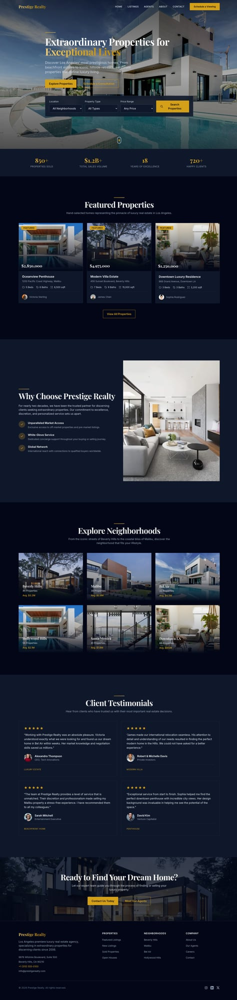

# Prestige Realty - Luxury Real Estate Template

A sophisticated, modern real estate website template built with Next.js 14, Tailwind CSS, and Framer Motion. Designed for luxury real estate agencies seeking an elegant, high-converting web presence.



## ✨ Features

### Design & UX
- **Dark luxury theme** with gold accents and premium typography
- **Smooth animations** powered by Framer Motion
- **Fully responsive** design (mobile, tablet, desktop)
- **Modern glass-morphism** effects and subtle gradients
- **Professional photography** integration with Unsplash

### Pages & Components
- **Home** - Hero with search, featured properties, neighborhoods, testimonials, stats
- **Listings** - Filterable property grid with search, sort, and multiple filter options
- **Property Detail** - Image gallery, features, agent info, contact form
- **Agents** - Team grid with agent profiles and social links
- **Agent Detail** - Full bio, specializations, active listings
- **About** - Company story, values, timeline, team showcase
- **Contact** - Contact form, FAQ, office information, map placeholder

### Functionality
- **Advanced filtering** - By neighborhood, property type, price range, status
- **Dynamic routing** - Individual pages for each property and agent
- **Search functionality** - Search by location, property type, and price
- **Contact forms** - Lead capture on multiple pages
- **Lazy loading** - Optimized image loading with Next.js Image

## 🚀 Quick Start

### Prerequisites
- Node.js 18+ 
- npm, yarn, or pnpm

### Installation

```bash
# Clone or download the template
cd realestate-starter

# Install dependencies
npm install

# Start development server
npm run dev

# Build for production
npm run build

# Start production server
npm start
```

Open [http://localhost:3000](http://localhost:3000) to view the site.

## 📁 Project Structure

```
realestate-starter/
├── src/
│   ├── app/
│   │   ├── about/page.tsx        # About page
│   │   ├── agents/
│   │   │   ├── [slug]/page.tsx   # Agent detail pages
│   │   │   └── page.tsx          # Agents listing
│   │   ├── contact/page.tsx      # Contact page
│   │   ├── listings/
│   │   │   ├── [slug]/page.tsx   # Property detail pages
│   │   │   └── page.tsx          # Properties listing
│   │   ├── layout.tsx            # Root layout
│   │   ├── page.tsx              # Home page
│   │   └── globals.css           # Global styles
│   ├── components/
│   │   ├── AgentCard.tsx         # Agent card component
│   │   ├── ContactForm.tsx       # Contact form component
│   │   ├── Footer.tsx            # Site footer
│   │   ├── ImageGallery.tsx      # Property image gallery
│   │   ├── Navbar.tsx            # Navigation bar
│   │   ├── PropertyCard.tsx      # Property listing card
│   │   ├── SearchBar.tsx         # Property search component
│   │   └── TestimonialCard.tsx   # Testimonial component
│   └── data/
│       └── mockData.ts           # Sample data & types
├── screenshots/                   # Template previews
├── next.config.mjs               # Next.js configuration
├── tailwind.config.ts            # Tailwind configuration
└── package.json
```

## 🎨 Customization

### Branding & Company Info
Edit `src/data/mockData.ts` to update:
- Company name, tagline, and description
- Contact information (address, phone, email)
- Social media links
- Statistics and milestones

### Properties
Modify the `properties` array in `mockData.ts`:
```typescript
{
  id: '1',
  slug: 'property-slug',
  title: 'Property Title',
  address: '123 Main St',
  neighborhood: 'Beverly Hills',
  price: 2850000,
  bedrooms: 5,
  bathrooms: 6,
  sqft: 8500,
  description: 'Property description...',
  features: ['Feature 1', 'Feature 2'],
  images: ['url1', 'url2'],
  // ... more fields
}
```

### Agents
Update the `agents` array with your team:
```typescript
{
  id: '1',
  slug: 'agent-name',
  name: 'Agent Name',
  title: 'Job Title',
  email: 'agent@company.com',
  phone: '+1 (310) 555-0101',
  image: 'https://...',
  bio: 'Agent biography...',
  specializations: ['Luxury Estates', 'Investment Properties'],
  // ... more fields
}
```

### Colors & Theme
Modify `tailwind.config.ts` to customize:
- Primary gold color (`gold: '#D4AF37'`)
- Dark theme shades (`dark-50` through `dark-950`)
- Typography fonts

### Images
Replace Unsplash URLs with your own images. Ensure your image host is added to `next.config.mjs`:
```javascript
images: {
  remotePatterns: [
    {
      protocol: 'https',
      hostname: 'your-image-host.com',
    },
  ],
}
```

## 📱 Responsive Breakpoints

| Breakpoint | Width | Description |
|------------|-------|-------------|
| Default | < 640px | Mobile phones |
| `sm` | ≥ 640px | Large phones |
| `md` | ≥ 768px | Tablets |
| `lg` | ≥ 1024px | Laptops |
| `xl` | ≥ 1280px | Desktops |
| `2xl` | ≥ 1536px | Large screens |

## 🔧 Tech Stack

- **Framework:** [Next.js 14](https://nextjs.org/) (App Router)
- **Styling:** [Tailwind CSS](https://tailwindcss.com/)
- **Animations:** [Framer Motion](https://www.framer.com/motion/)
- **Typography:** Inter (sans) + Playfair Display (serif)
- **Images:** Next.js Image with remote patterns
- **Language:** TypeScript

## 📄 License

This template is available for commercial and personal use.

## 🤝 Support

For questions or customization requests, please open an issue or contact the template author.

---

Built with ❤️ for luxury real estate professionals.
